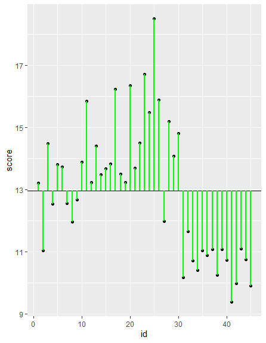
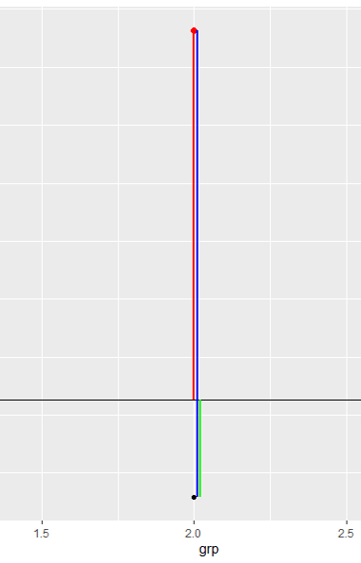

# 从两个角度去看方差分析

说明：
1. 平方和（sum of squares, SS)是我们常用的一种简称，指的就是类似$\sum{(...)^2}$这样的形式
2. 对于一个3组比较，每组样本量各自为$n_1, n_2, n_3$的数据，$\sum_{i=1}^k{\sum_{j=i}^{n_i}{(x_{ij}-\bar{x})^2}}$指的是$x_11,x_12,...x1n_1$各项减$\bar{x}$差的平方的和，加上$x_21,x_22,...x2n_2$各项减$\bar{x}$差的平方的和，加上...直到$x_k1,x_k2,...xkn_k$各项减$\bar{x}$差的平方的和。

## 方差的分解

1. 完全随机分组设计的方差分析

$SS_总=\sum_{i=1}^k{\sum_{j=i}^{n_i}{(x_{ij}-\bar{x})^2}}$
$=\sum_{i=1}^k{\sum_{j=i}^{n_i}{(x_{ij}-\bar{x_i}+\bar{x_i}-\bar{x})^2}}$
$=\sum{\sum{((x_{ij}-\bar{x_i})^2+2(x_{ij}-\bar{x_i})(\bar{x_i}-\bar{x})+(\bar{x_i}-\bar{x})^2)}}$
$=\sum{\sum{(x_{ij}-\bar{x_i})^2}}+\sum\sum{2(x_{ij}-\bar{x_i})(\bar{x_i}-\bar{x})}+\sum{\sum{(\bar{x_i}-\bar{x})^2}}$
对于任何一组(i=1,2,...k)，都有该组所有项减该组均值的差的和为0($\sum{(x-\bar{x})}=0$, 详见公式推导，平均值的性质)，所以上面三项中的第二项为0，于是有
$SS_总=\sum{\sum{(x_{ij}-\bar{x_i})^2}}+\sum{\sum{(\bar{x_i}-\bar{x})^2}}$

2. 分解的意义

在讲方差分解以前，我们考虑这样一个问题，假如现在有一个变量x，一个变量y，现在我们用一个模型$\hat{y}=\beta_1 x+\beta_0$来根据x对y进行估计，那么这个模型到底好不好呢？我们尝试使用各个预测值$\hat{y}$与真实值y之间的距离的平方的和（$\sum{(y-\hat{y})^2}$）来作为评判标准，当这个ss最小的时候，我们认为模型是最好的。这种办法也就是线性回归中常用的最小二乘法。

简单来说，最小二乘法就是：
1. 利用一个模型根据自变量x的值$x_1,x_2,...x_n$计算因变量y的预测值$\hat{y_1}, \hat{y_2},..., \hat{y_n}$
2. 计算$SS=\sum{(y_i-\hat{y_i})^2}$
3. 通过优化模型的参数让SS最小 

回到方差分析，考虑这样一个简单的例子：3组志愿者，n1=n2=n3=15，三组数据箱式图如下图所示

数据集包括三个变量：id，1至45的一个记录编号；grp：1到3，提供分组信息；score：提供分数信息。现在让我们先考虑仅仅用id作为自变量，score作为因变量，用id去预测score。当我们以id作为x轴，score作为y轴的时候，可以看到数值的分布是没有什么规律的：

于是模型没有任何可用的自变量，现在预测模型为$\hat{y}=\beta_0$, 而$SS=\sum{(y_i-\beta_0)^2}$，从平均值的性质可以知道当$\beta_0=\bar{y}=\frac{\sum_{i=1}^3\sum_{j=1}^{n_i}{y_{ij}}}{45}$的时候SS取极小值。这个时候的SS:
$SS = \sum{(y-\bar{y})^2}$
就是不考虑任何自变量的时候得到的SS极小值，也就是在方差分析中所提到的$SS_总$

现在当我们加入分组grp这个自变量以后，现在单纯看grp=1的第一组，这组的15个数据，要令$SS=\sum{(y_i-\hat{y_i})^2}$最小，也只能令$\hat{y_i}=\sum_{j=1}^{n_1}{y_j}/n_1$，也就是第一组的算数平均值$\bar{y_1}$, 此时最小的SS就是$\sum{(y-\bar{y_1})^2}$; 同理，对于第二组和第三组，其对应的最佳的SS分别是$\sum{(y-\bar{y_2})^2}$和$\sum{(y-\bar{y_3})^2}$，将三组的SS相加有：
$SS_{组内}=\sum_{i=1}^{k}{\sum_{j=1}^{n_i}{(y-\bar{y_i})^2}}$
这个也就是方差分解中等号右边的第一项

那么方差分解中，等式右边的第二项，$SS_{组间}=\sum{\sum{(\bar{y_i}-\bar{y})^2}}$就是两者的差，可以理解为引入分组grp这个自变量以后，将原先没有任何可参考信息时的$SS_总$，缩小到引入分组grp自变量后的$SS_{组内}$，所减少的**误差**

在方差分析中，对于任何一个数据点（图中的黑点），数据点到全体数据均值($\bar{y}$)之间距离（图中绿线）距离平方和就是$SS_总$, 数据点到组内均值（$\bar{y_i}$, 图中红点）的距离（图中蓝线）的平方的和就是$SS_{组内}$。而各组均值$\bar{y_i}$到全体数据均值$\bar{y}$之间距离（图中红色线）的平方和则是$SS_{组间}$。在引入分组以后，原先对y的预测模型从只能使用一个单一的均值$\bar{y}$变成了根据不同组使用对应的均值$\bar{y_i}$，于是表示误差的SS从$SS_{总}$减少到了$SS_{组内}$，减少的部分$SS_{组间}$就是引入的分组变量grp所产生的贡献。而且我们还可以用：
$R^2=\frac{SS_{组间}}{SS_{总}}$这个比值来说明引入的自变量可以多大程度上**解释**变异。试想一下，如果$SS_{组间}=SS_{总}$，那么$SS_{组内}=0$，也就是说在引入grp自变量以后，组内已经不存在任何变异了，grp可以完全解释score的任何变动。而与之相反的，如果$SS_{组间}=0$，那么$$SS_{组内}=SS_总$，也就是说引入的grp变量以后，不能解释任何总体的变异，于是grp这个变量的引入就没有意义。

总而言之，可以这样理解：
1. $SS_总$表示的是没有任何自变量的时候，因变量内含的变异；
2. $SS_{组间}$表示的是通过引入自变量，所减少的变异；
3. $SS_{组内}$表示的是引入自变量后，仍旧无法消除的变异。

## 组内方差和组间方差是对总体方差的两种估计

方差分析之所以最后可以落实到F分布，其原因就是当H0成立的时候，组内方差和组间方差是对总体方差的两种估计。

三组相比较的方差分析的H0虽然写作$\mu_1=\mu_2=\mu_3$，但是实际上指的是三组样本实际上是来自同一个总体。现在为了方便推导，我们限制三组的样本量相同，均为n，参考2独立样本均值比较的t检验中，满足方差齐性假定后的$s_c$公式，从三组的$SS_{组内}$估算总体方差的公式为：
$s_{组内途径}^2=\frac{\sum{\frac{\sum{(x-\bar{x_i})^2}}{n_i-1}\times (n_i-1)}}{\sum{n_i}-k}=\frac{\sum{\sum{(x-\bar{x_i})^2}}}{\sum{n_i}-k}=\frac{SS_{组内}}{N-k}$
其中$N=\sum{n_i}$，所以，方差分析计算表中的$MS_{组内}$也就是从组内途径，通过自由度加权平均的方法对总体方差的一个估计。

接下来看一下组间途径。现在我们认为各组来自同一个总体，所以各组均值的方差就是从总体中等容量抽样的样本均值方差，等于总体方差除以样本量，即有：
$\frac{\sum{(\bar{x_i}-\bar{x})^2}}{k-1}=\frac{s_{组间途径}^2}{n}$
两侧均乘以n，于是有
$s_{组间途径}^2=\frac{n\sum{(\bar{x_i}-\bar{x})^2}}{k-1}$
$s_{组间途径}^2=\frac{SS_{组间}}{k-1}$
可见，计算表中的$MS_{组间}$就是从组间途径对总体方差进行的估计。

既然三组来自同一个总体，那么从组间途径和组内途径都是对同一个方差做出的估计，于是两个估计的方差在做F检验的时候，P值就不应该小于检验水平$\alpha$。

