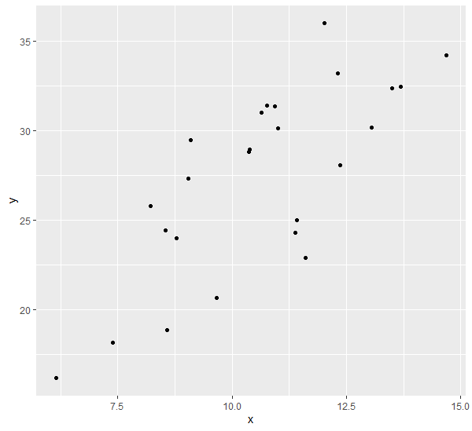
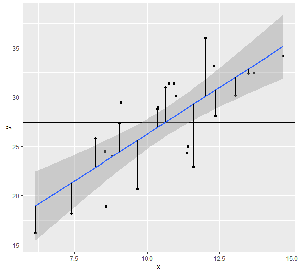
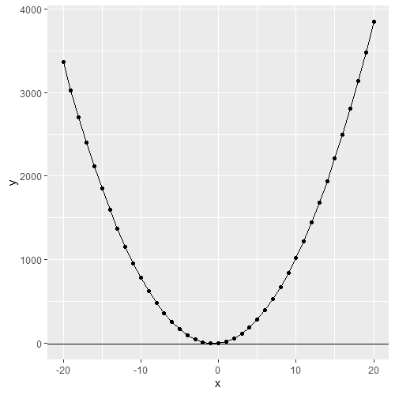

#! https://zhuanlan.zhihu.com/p/313769854
# 简单线性回归方程beta0与beta1的推导
> 思路来源于eco375f的tutorial，已经搬运到b站，可以前往[这里](https://www.bilibili.com/video/BV1sb411e75g?p=1)

假如我们测量了一群小鼠的身长（x）与体重（y），获得了如下的数据：

id|x|y
--|--|--
1|9.52|31.78
2|11.01|29.57
3|9.12|29.65
4|13.28|30.91
5|9.24|26.79
6|9.78|30.69
7|10.49|20.31
8|8.91|27.65
9|10.28|31.93
10|8.81|30.01
11|7.92|35.21
12|10.83|26.93
13|12.72|36.24
14|11.60|25.93
15|11.51|30.59
16|12.40|37.81
17|4.89|16.66
18|11.62|27.25
19|7.90|20.41
20|14.06|35.16
21|9.99|34.06
22|11.88|37.74
23|10.60|25.18
24|9.27|26.71
25|11.10|28.79

如果我们绘制一个散点图可以看到：

## 线性模型

体重y与身长x似乎有线性的相关性。照理说身长长的老鼠体重应该也会相应增加，所以可以考虑两者之间存在一个解释的关系（身长作为自变量可以解释体重的大小），也就是会有下面的线性关系：

$y = \beta_0+\beta_1x+u$

其中u表示**无法被线性方程解释的误差**

但是由于我们只拿到了一个样本量为25的样本，无法对真实的$\beta_0, \beta_1$去进行计算，只能从样本去计算样本的统计量去对总体参数作估计，而$\beta_0, \beta_1$的样本统计量则记为$\hat{\beta_0}, \hat{\beta_1}$

而使用下面式子计算出来的则记为$\hat{y}$，是根据x（自变量，身长）对因变量y，也就是体重的估算：

$\hat{y}=\hat{\beta_0}+\hat{\beta_1}x$

而这个式子也就是一个最简单的**线性模型**。这个模型的输入是自变量x（身长），输出是因变量$\hat{y}$（体重），而通过一定的规则去调整$\hat{\beta_0}, \hat{\beta_1}$，我们可以对这个模型进行优化。

## 优化

对于简单线性回归方程这种线性模型，我们一般采用**最小二乘法**来进行优化。对于一组$\hat{\beta_0}, \hat{\beta_1}$，我们可以获取一条线$\hat{y}=\hat{\beta_0}+\hat{\beta_1}x$，于是对于刚才数据表中的25个数据点，每一个x都可以计算出一个$\hat{y}$，可以预见的是，每一个数据点的y和方程计算出来的$\hat{y}$之间肯定是有一个差距的，我们可以将其记为$\hat{u}$，（也就是下图中的黑色线段），于是有

$\hat{u} = y-\hat{y}= y-\hat{\beta_0}-\hat{\beta_1}x$

所以当$\sum{\hat{u}^2}=\sum{(y-\hat{\beta_0}-\hat{\beta_1}x)^2}$取最小值的时候，各个数据点实际的y与线性模型预测的$\hat{y}$的距离平方的总和最小，这时候模型预测的值与真实值偏离的水平最小，$\hat{\beta_0}, \hat{\beta_1}$是最好的。所以接下来的问题就是，$\hat{\beta_0}, \hat{\beta_1}$分别取什么值的时候，$\sum{\hat{u}^2}$最小呢？可以看到这是一个2次方程的优化问题，对于$(a+bx)^2$这样的二次方程，其一阶导数为0的时候取极小值

上图中，对$(a+bx)^2$求导$\frac{d(a+bx)^2}{dx}$可得当$x=-\frac{a}{b}$的时候该二次函数取极小值。

### FOC1

回到$\sum{(y-\hat{\beta_0}-\hat{\beta_1}x)^2}$的极小值问题，我们可以分别对$\hat{\beta_0}, \hat{\beta_1}$求导，得到两个微分方程,也就是在$\hat{u}^2$取极小值的时候有：

FOC1，对$\hat{\beta_0}$求导:

$\sum{(y-\hat{\beta_0}-\hat{\beta_1}x)}=0$

FOC2，对$\hat{\beta_1}$求导:

$\sum{(y-\hat{\beta_0}-\hat{\beta_1}x)x}=0$

这里首先是根据求和运算的性质将求导符号写到了求和符号里面。比如对于$\sum{a+bx}=(a+bx_1)+(a+bx_2)+...(a+bx_n)$, 这个和对b求导的时候则有$\frac{d(a+bx_1)}{db}+\frac{d(a+bx_2)}{db}+...\frac{d(a+bx_n)}{db}=\sum{\frac{d(a+bx)}{db}}$。

然后用到了求导的链式规则，比如对于$y=(a+bx)^2$求b的导数：$\frac{d(a+bx)^2}{db}$，首先可以令$z=a+bx$，而$y=z^2$，那么当我们求y关于b的导数的时候，这个式子可以写成$\frac{dy}{db}=\frac{dy}{dz}\frac{dz}{db}$, 其中$\frac{dy}{dz}=2z=2(a+bx)$, $\frac{dz}{db}=x$，所以$\frac{dy}{db}=2(a+bx)x$

尝试自己根据上面的提示推导FOC1和FOC2

根据FOC1，可以知道$\sum{y}-n\beta_0-\beta_1\sum{x}=0$, 除以n，将$\beta_0，x$转移到右边，有

$\bar{y}=\hat{\beta_0}+\hat{\beta_1}\bar{x}$

也就是说，下面这幅图

对于最优化的线，这条线必然经过$(\bar{x},\bar{y})$这个点。

另一方面，由于$\sum{(y-\hat{\beta_0}-\hat{\beta_1x})}=\sum{\hat{u}}=0$，也就是说，对于样本中所有的数据点，上图中黑色数据点y减去对应在线性模型上的$\hat{y}$的差值，其总和为0。

此外还可以根据FOC1推出$\hat{\beta_0}$

$\hat{\beta_0}=\sum{(y-\hat{\beta_1}x)}/n=\bar{y}-\hat{\beta_1}\bar{x}$

### FOC2

进一步说明以前，先看一下x与y协方差的分子部分：

$\sum{(y-\bar{y})(x-\bar{x})}=\sum{xy}-\bar{y}\sum{x}-\bar{x}\sum{y}+n\bar{x}\bar{y}=\sum{xy}-n\bar{x}\bar{y}$

其实将上面式子中的y替换成x就变成了方差公式分子的变换：

$\sum{(x-\bar{x})^2}=\sum{x^2}-n\bar{x}^2$

接下来看FOC2

$\sum{(y-\hat{\beta_0}-\hat{\beta_1}x)x}=0$
$\sum{(yx-\hat{\beta_0}x-\hat{\beta_1}x^2)}=0$

将求和符号分别对三项求和

$\sum{yx}-\hat{\beta_0}\sum{x}-\hat{\beta_1}\sum{x^2}=0$

将FOC1中关于$\hat{\beta_0}$的结果带入，有

$\sum{yx}-(\bar{y}-\hat{\beta_1}\bar{x}))\sum{x}-\hat{\beta_1}\sum{x^2}=0$
$\sum{yx}-n\bar{y}\bar{x}-\hat{\beta_1}(\sum{x^2}-n\bar{x}^2)=0$

于是有

$\hat{\beta_1}=\frac{\sum{yx}-n\bar{y}\bar{x}}{\sum{x^2}-n\bar{x}^2}$

如果分子分母同时除以n，则分子变成cov(x,y)，分母变成var(x)，于是也有

$\hat{\beta_1} = \frac{\hat{cov(x,y)}}{\hat{var(x)}}$

分别加帽是强调这都是根据样本获得的统计量，不是参数。
